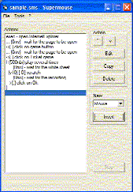



## SuperMouse : to become a manipulator

### Description

Supermouse enables you to build scripts which perform repetitive mouse

tasks. But it also go a step farther, and brings the possibility to check

the screen in order to decide which task to proceed. Here is the liste of

the possible actions for a Supemouse script:

- Mouse actions (move in line, ine circle, several clicks)

- Wait (duration or pixel color)

- Loop (duration or number)

- Condition (depending on a pixel color)

- Label and Goto

- Execute an external application

- Send keys

- Display a message

----

Skrol 29

www.skrol29.com

----

 
### More Info
 

             |
---                |---
**Submitted On**   |2003-04-17 12:15:36
**By**             |[Skrol 29](https://github.com/Planet-Source-Code/PSCIndex/blob/master/ByAuthor/skrol-29.md)
**Level**          |Advanced
**User Rating**    |4.9 (34 globes from 7 users)
**Compatibility**  |VB 6\.0
**Category**       |[Complete Applications](https://github.com/Planet-Source-Code/PSCIndex/blob/master/ByCategory/complete-applications__1-27.md)
**World**          |[Visual Basic](https://github.com/Planet-Source-Code/PSCIndex/blob/master/ByWorld/visual-basic.md)
**Archive File**   |[SuperMouse158466572003\.zip](https://github.com/Planet-Source-Code/skrol-29-supermouse-to-become-a-manipulator__1-35936/archive/master.zip)

